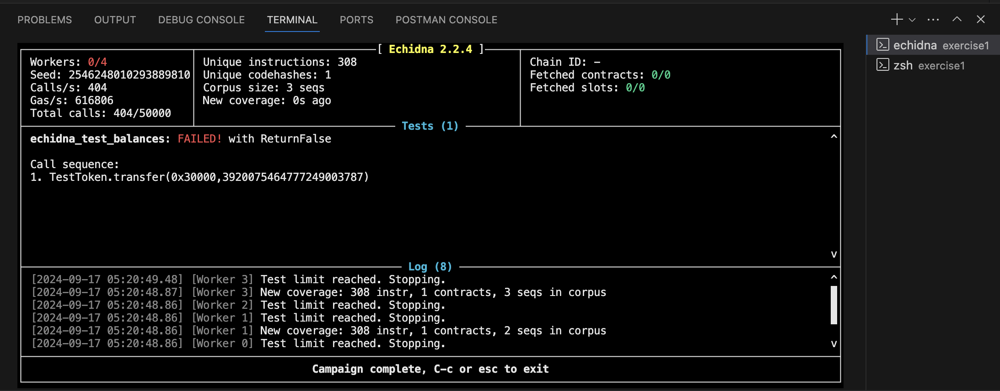
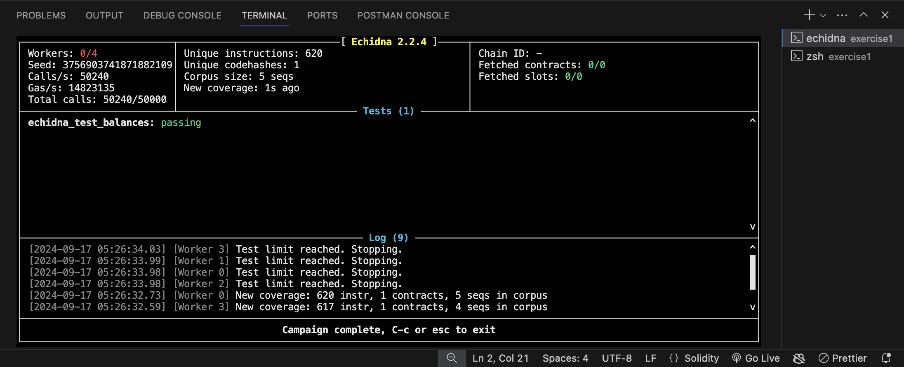

As the solidity version 0.7.0 by default is not using a safemath library so their are chances 
of overflwo and underflow see if their exists an overflow underflow condition we use echidna fuzzer and got the below error 

And when i run with solc verison 0.8.0 it gives me this 

so 0.8.0 and above auto check for overflow and underflow conditions