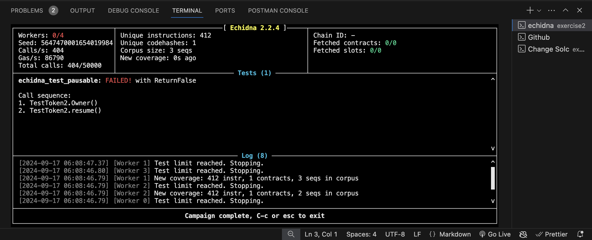
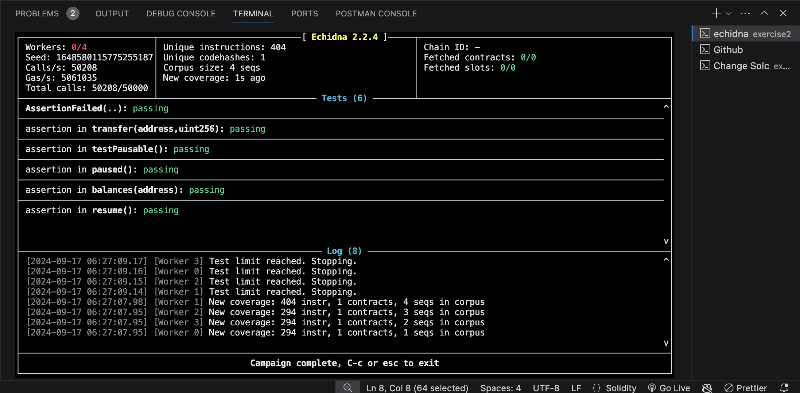

Why echidna is special as it can call the functin in sequence and do stateful testing 

 echidna testToken.sol --test-mode assertion --- For testing in assertion mode

 after commenting out the owner function 
 